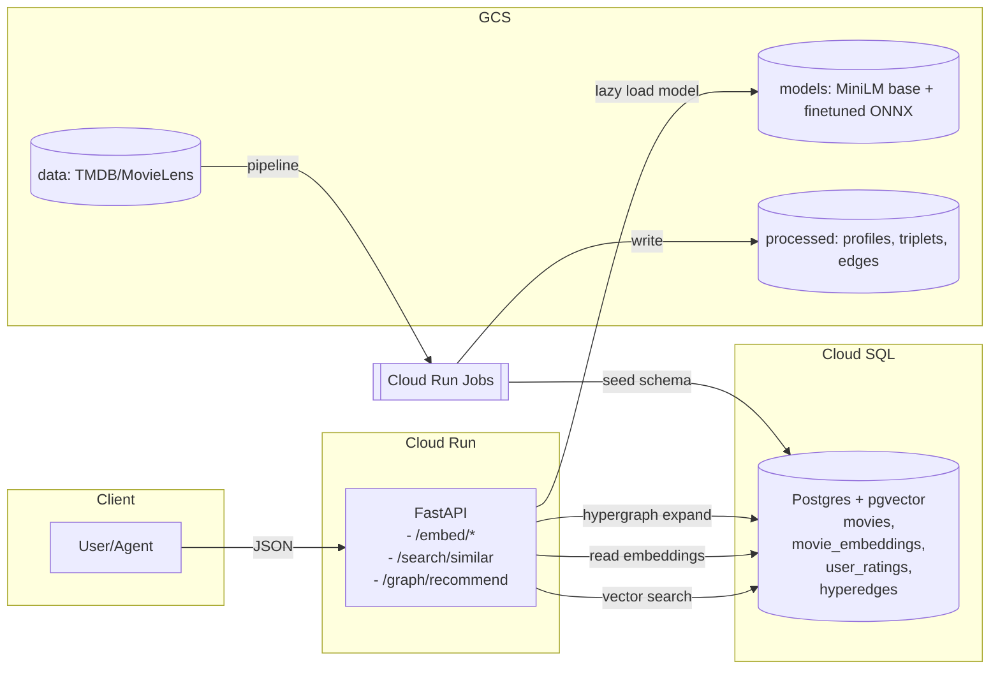

<div align="center">

# CR-HyperVR

**Cloud Run Hypergraph-Vector Recommender**

*CPU-only FastAPI service using INT8 ONNX MiniLM, pgvector similarity, and hyperedge signals.*

---

</div>

CR-HyperVR is a lightweight web service that recommends films based on their descriptions and people's past ratings. It creates compact summaries of each film and of a person's tastes, then searches for the closest matches to suggest what to watch next. It also uses simple links between related films (like shared genres or being liked by the same people) and runs in the cloud so it stays quick and reliable.

The system uses a compact text-embedding model that we finetune on CPUs to create stable, low-dimensional representations of films and user preferences, minimising cost and latency while allowing regular updates without specialist hardware. At query time it retrieves likely candidates by comparing these embeddings, then refines the ranking with a hypergraph that captures relations such as co-watching and shared genres so multiple signals inform each suggestion. This combination of CPU-based finetuning and hypergraph reasoning improves robustness with sparse data, eases cold-start problems, and delivers more accurate, consistent results at scale.

---

## Quick Links

| Resource | Details |
|----------|---------|
| **Project** | `agentics-foundation25lon-1809` |
| **Region** | `europe-west2` |
| **Default service** | `embedding-service` (public) |
| **Graph service** | `infra-service` (public, graph features enabled) |

---

## Overview

- **Purpose:** expose JSON FastAPIs for embedding, vector search, and graph-aided recommendation on Google Cloud Run.
- **Architecture:** FastAPI + ONNXRuntime (INT8 MiniLM) + Cloud SQL (Postgres/pgvector). Optional graph and rerank toggles per service.
- **Services:** `embedding-service` (default), `infra-service` (graph-focused; same image with graph features enabled).
- **Region/Project (current deployment):** `agentics-foundation25lon-1809` in `europe-west2`.

---

## Key Constraints

> From PRD

- CPU-only inference and fine-tuning; no GPU requirement.
- Cloud Run deployment: stateless, auto-scaling containers (1-10 instances by default).
- Latency targets: <10ms per embedding, <30ms end-to-end recommendation (P95).
- Cost efficiency: design for low monthly cost at MVP scale.

---

## Success Metrics

> From PRD

| Metric | Target |
|--------|--------|
| Embedding latency P95 | < 10 ms |
| End-to-end recommendation P95 | < 30 ms |
| Recommendation accuracy | > 0.65 NDCG@10 (offline) |
| Cold start time | < 10 s |
| Concurrency per instance | > 80 requests |

---

## High-Level Architecture

> Public summary

- **Embedding service** (FastAPI on Cloud Run): hosts INT8 ONNX MiniLM, exposes JSON endpoints for embedding and search; optional reranker and graph boost.
- **Vector store** (Cloud SQL + pgvector): stores 384-D embeddings, HNSW index, cached user vectors, hyperedges.
- **Hypergraph signals:** co-watch edges and shared-genre links; combined with embedding scores.
- **Fine-tuning pipeline:** CPU-based MNR/triplet training on TMDB + MovieLens; export to ONNX and quantize to INT8.

---

## Repository Structure

### What's in this repo (cloud-only)

| Directory | Contents |
|-----------|----------|
| `app/` | FastAPI app, schemas, DB client, embedders, scoring |
| `db/` | pgvector enablement and schema |
| `training/` | CPU finetune, ONNX export, INT8 quantization (batch jobs or Cloud Shell) |
| `pipeline/` | Data prep for Phase 2 (user profiles, triplets) used by finetuning and validation |
| `scripts/` | Cloud-only helpers (provision, deploy to Cloud Run, apply schema on Cloud SQL, Cloud Run Jobs, GCS uploads, verification, activity log) |
| Root | `Dockerfile`, `cloudbuild.yaml`, `Makefile` (GCP targets only) |

### What's intentionally excluded

Local/dev frameworks (BMAD), unit tests, local docker-compose, Dockerfile.dev, gitignore, or any local deployment guidance. All paths here assume use from GCP (Cloud Shell/Cloud Build/Cloud Run), not a developer laptop.

---

## Quickstart

**Public service address** (as of 2025-12-07):

| Service | URL |
|---------|-----|
| Embeddings/API | https://embedding-service-5pgvctvdpq-nw.a.run.app |
| Infra service | Fetch with: `gcloud run services describe infra-service --region=europe-west2 --format='value(status.url)'` |

**One-liner health check:**

```bash
curl -s https://embedding-service-5pgvctvdpq-nw.a.run.app/healthz
```

**Example: embed text**

```bash
curl -s -X POST https://embedding-service-5pgvctvdpq-nw.a.run.app/embed/text \
  -H 'content-type: application/json' \
  -d '{"text":"A sci-fi thriller with mind-bending twists."}'
```

---

## Comprehensive Quickstart (Cloud Shell)

### 1. Set environment

```bash
export PROJECT_ID=agentics-foundation25lon-1809
export REGION=europe-west2
```

### 2. Verify project, APIs, service accounts, buckets, SQL, secrets

```bash
make gcp-verify    # shell-based checks
make gcp-verify-py # python-based checks
```

### 3. Provision core infrastructure (idempotent)

```bash
bash scripts/provision_core.sh \
  PROJECT_ID=$PROJECT_ID REGION=$REGION \
  SQL_INSTANCE=embeddings-sql-$REGION DB_NAME=movies DB_USER=app_user
```

### 4. Upload datasets and base model to GCS

> Optional now; recommended before training

```bash
PROJECT_ID=$PROJECT_ID REGION=$REGION \
DATA_BUCKET=gs://agentics-foundation25lon-1809-europe-west2-datasets-20251207 \
MODEL_BUCKET=gs://agentics-foundation25lon-1809-europe-west2-models-20251207 \
bash scripts/upload_gcs_assets.sh
```

### 5. Build and push container image to Artifact Registry

```bash
PROJECT_ID=$PROJECT_ID REGION=$REGION make gcp-build
```

### 6. Enable pgvector and apply database schema on Cloud SQL

```bash
SQL_INSTANCE=embeddings-sql-europe-west2 DB_NAME=movies make db-apply-cloudsql
```

### 7. Deploy embedding-service to Cloud Run (public)

```bash
PROJECT_ID=$PROJECT_ID REGION=$REGION make gcp-deploy
SERVICE_URL=$(gcloud run services describe embedding-service --region=$REGION --format='value(status.url)')
```

### 8. Smoke test

```bash
curl -s "$SERVICE_URL/healthz"
curl -s -X POST "$SERVICE_URL/embed/text" -H 'content-type: application/json' \
  -d '{"text":"A cozy mystery with dry humor."}' | jq '.dimension,.model' || true
```

### 9. Deploy infra-service (optional)

> Graph features on by default

```bash
PROJECT_ID=$PROJECT_ID REGION=$REGION make gcp-deploy-infra
INFRA_URL=$(gcloud run services describe infra-service --region=$REGION --format='value(status.url)')
curl -s -X POST "$INFRA_URL/graph/recommend" -H 'content-type: application/json' \
  -d '{"query":"mind-bending sci-fi thriller","top_k":10,"seed_top_k":50,"hops":2}' | jq '.items[0]'
```

### 10. Run Phase-2 pipeline as Cloud Run Job (optional)

```bash
# Deploy jobs with environment prefixes; edit DATA/PROCESSED/TRIPLETS paths as needed
PROJECT_ID=$PROJECT_ID REGION=$REGION make gcp-jobs-deploy
gcloud run jobs run pipeline-phase2 --region=$REGION --wait
```

### 11. Observability and debugging

```bash
curl -s "$SERVICE_URL/metrics" | head -n 20
curl -s "$SERVICE_URL/debug/db_counts"
curl -s "$SERVICE_URL/debug/sample_movie"
```

### 12. Configuration toggles (env vars)

| Variable | Description |
|----------|-------------|
| `MODEL_GCS_URI` | Pull ONNX from GCS at startup; else local cached model is used |
| `EMBEDDING_BACKEND` | `auto\|onnx\|st\|hash` to control embedding path |
| `USE_GRAPH_SCORER` | `true\|false` |
| `GRAPH_SCORE_WEIGHT` | Blend graph weights |
| `USE_RERANKER` | `true\|false` to enable the lightweight title-token reranker |

---

## API Summary

> JSON FastAPIs

| Method | Endpoint | Response |
|--------|----------|----------|
| `GET` | `/healthz` | `{ status: "ok" }` |
| `GET` | `/ready` | Lightweight readiness check |
| `GET` | `/metrics` | Prometheus-style counters |
| `POST` | `/embed/text` | `{ embedding: float[], dimension: 384, model: "movie-minilm-v1" }` |
| `POST` | `/embed/batch` | Batch embeddings |
| `POST` | `/embed/movie` | Embed title+genres+overview |
| `POST` | `/embed/user` | Embed short user preference summary |
| `POST` | `/search/similar` | Vector search in pgvector; optional graph boost and optional rerank |
| `POST` | `/search/recommend` | User-centric recommendations |
| `POST` | `/graph/recommend` | Seed via vector; expand via hyperedges (co-watch, shared-genre); return ranked items with signal sources |

---

## Example Requests

```bash
SERVICE=https://embedding-service-5pgvctvdpq-nw.a.run.app

# Embed text
curl -s -X POST "$SERVICE/embed/text" -H 'content-type: application/json' \
  -d '{"text":"A cozy mystery with dry humor."}' | jq .dimension

# Search similar
curl -s -X POST "$SERVICE/search/similar" -H 'content-type: application/json' \
  -d '{"text":"heist thriller in Las Vegas","top_k":10}' | jq '.items[0]'

# Graph-focused endpoint (works from either service; `infra-service` enables graph by default)
INFRA_URL=$(gcloud run services describe infra-service --region=europe-west2 --format='value(status.url)' || true)
curl -s -X POST "$INFRA_URL/graph/recommend" -H 'content-type: application/json' \
  -d '{"query":"mind-bending sci-fi thriller","top_k":10,"seed_top_k":50,"hops":2}' | jq '.items[0]'
```

---

## System Diagrams

### Architecture Overview



### Graph Reasoning (Scoring Signals)

```mermaid
flowchart TB
  Q[Query embedding]
  E{{Embed candidates via pgvector}}
  C{{Co-watch edges}}
  G{{Shared-genre edges}}
  N{{Normalize each signal [0..1]}}
  W{{Weighted sum: w_e*E + w_c*C + w_g*G}}
  R[Rank + return with sources]

  Q --> E --> N
  C --> N
  G --> N
  N --> W --> R
```

---

## GCP-Only Deployment

### Assumptions

Run from Google Cloud Shell with project set. No local `gcloud auth` instructions are required or used.

### Current Deployment Details

| Resource | Value |
|----------|-------|
| Project | `agentics-foundation25lon-1809` |
| Region | `europe-west2` |
| Artifact Registry repo | `embedding-service` (Docker) in `europe-west2` |
| Cloud SQL 15 instance | `embeddings-sql-europe-west2` (connection name printed by scripts) |
| Secret Manager | `database-url` (Cloud SQL connector DSN) |
| Service accounts | `embedding-service@agentics-foundation25lon-1809.iam.gserviceaccount.com`<br>`embedding-jobs@agentics-foundation25lon-1809.iam.gserviceaccount.com` |

### Provision Core Infra (idempotent)

```bash
# Cloud Shell
export PROJECT_ID=agentics-foundation25lon-1809
export REGION=europe-west2
bash scripts/provision_core.sh
```

### Build and Deploy

```bash
# Build and push image to Artifact Registry
PROJECT_ID=$PROJECT_ID REGION=$REGION make gcp-build

# Apply pgvector + schema on Cloud SQL
SQL_INSTANCE=embeddings-sql-europe-west2 DB_NAME=movies make db-apply-cloudsql

# Deploy embedding-service (public)
PROJECT_ID=$PROJECT_ID REGION=$REGION make gcp-deploy

# Optional: deploy infra-service with graph toggled on
PROJECT_ID=$PROJECT_ID REGION=$REGION make gcp-deploy-infra
```

---

## Using the Infra-Service Endpoint

**Purpose:** expose `/graph/recommend` tuned for multi-signal ranking (embed + co-watch + shared-genre). Same image, separate service.

**Fetch URL and call:**

```bash
INFRA_URL=$(gcloud run services describe infra-service --region=europe-west2 --format='value(status.url)')
curl -s -X POST "$INFRA_URL/graph/recommend" -H 'content-type: application/json' \
  -d '{
        "query":"crime drama set in Boston",
        "top_k":10, "seed_top_k":60, "hops":2,
        "embed_weight":0.7, "cowatch_weight":0.2, "genre_weight":0.1
      }'
```

---

## Agent Playbook

### Deploy and Test Services

**Pre-set context (Cloud Shell):**

```bash
export PROJECT_ID=agentics-foundation25lon-1809
export REGION=europe-west2
```

**Build and push image:**

```bash
PROJECT_ID=$PROJECT_ID REGION=$REGION make gcp-build
```

**Ensure DB schema exists (idempotent):**

```bash
SQL_INSTANCE=embeddings-sql-europe-west2 DB_NAME=movies make db-apply-cloudsql
```

**Deploy embeddings-service and fetch URL:**

```bash
PROJECT_ID=$PROJECT_ID REGION=$REGION make gcp-deploy
SERVICE_URL=$(gcloud run services describe embedding-service --region=$REGION --format='value(status.url)')

# Health check
curl -s "$SERVICE_URL/healthz"

# Embed example
curl -s -X POST "$SERVICE_URL/embed/text" -H 'content-type: application/json' \
  -d '{"text":"A cozy mystery with dry humor."}'
```

**Deploy infra-service and fetch URL:**

```bash
PROJECT_ID=$PROJECT_ID REGION=$REGION make gcp-deploy-infra
INFRA_URL=$(gcloud run services describe infra-service --region=$REGION --format='value(status.url)')

# Graph example
curl -s -X POST "$INFRA_URL/graph/recommend" -H 'content-type: application/json' \
  -d '{"query":"mind-bending sci-fi thriller","top_k":10,"seed_top_k":50,"hops":2}'
```

**Notes for agents:**

- All scripts/targets are idempotent and safe to rerun.
- If a secret or SA is missing, run `scripts/provision_core.sh` first.
- Prefer `make gcp-verify` before deploying to confirm APIs, SAs, buckets, SQL, and secrets.

---

## Agent One-Liners (Cheat Sheet)

**Build, Deploy `embedding-service`, Smoke test:**

```bash
PROJECT_ID=$PROJECT_ID REGION=$REGION make gcp-build && make gcp-deploy && \
  gcloud run services describe embedding-service --region=$REGION --format='value(status.url)'

curl -s "$SERVICE_URL/healthz"
```

**Deploy `infra-service` and call graph endpoint:**

```bash
PROJECT_ID=$PROJECT_ID REGION=$REGION make gcp-deploy-infra && \
  INFRA_URL=$(gcloud run services describe infra-service --region=$REGION --format='value(status.url)')

curl -s -X POST "$INFRA_URL/graph/recommend" -H 'content-type: application/json' \
  -d '{"query":"mind-bending sci-fi thriller","top_k":10,"seed_top_k":50,"hops":2}'
```

---

## Data Sourcing

### Kaggle/TMDB

- **MovieLens 25M** ratings and links (Kaggle). Obtain API credentials and download to local workspace or upload directly to your project GCS bucket.
- **TMDB movies CSV** (Kaggle or TMDB dump) with `title`, `overview`, `genres`, `status`, `release_date`.

### Recommended GCS layout

> Already used in this project

```
gs://agentics-foundation25lon-1809-europe-west2-datasets-20251207/data/movielens/ml-25m/...
gs://agentics-foundation25lon-1809-europe-west2-datasets-20251207/data/tmdb/TMDB_movie_dataset_v11.csv
```

### Upload helper with verification

```bash
PROJECT_ID=$PROJECT_ID REGION=$REGION \
DATA_BUCKET=gs://agentics-foundation25lon-1809-europe-west2-datasets-20251207 \
MODEL_BUCKET=gs://agentics-foundation25lon-1809-europe-west2-models-20251207 \
bash scripts/upload_gcs_assets.sh
```

---

## Model Sourcing

### MiniLM and Formats

- **Base model:** `sentence-transformers/all-MiniLM-L6-v2` (downloaded inside the Docker build and cached to `models/base-minilm`).
- **Fine-tuned model:** produced by Phase 3 training; export to ONNX then quantize to INT8.
- **GCS model paths:** expected by the service if `MODEL_GCS_URI` is set, else local `models/movie-minilm-v1/`.

---

## Finetuning Pipeline

### CPU-only to ONNX to INT8

**Phase 2 (data joins):** build user profiles and triplets in GCS

```bash
python pipeline/user_profiles.py
python pipeline/triplets.py
```

**Phase 3 (finetune):** train on CPU; hyperparameters kept small for reproducibility

```bash
python training/train_finetune.py
```

**Export to ONNX:**

```bash
python training/onnx_export.py
```

**Quantize to INT8** (per-tensor, dynamic):

```bash
python training/quantize_int8.py
```

**Upload artifacts** to `gs://.../models/movie-minilm-v1/` and set `MODEL_GCS_URI` or `GCS_MODELS_BUCKET` when deploying so the service lazily pulls the ONNX file on first request.

---

## Edge Validation Mechanisms

- **Coverage check** of triplets vs database contents: `scripts/validate_triplets_coverage.py` prints counts of referenced movies and embeddings; exit non-zero on gaps.

- **Hyperedge build** is two-phase and bounded to keep memory stable:
  1. Generate per-part co-watch edges, persist to `hyperedges_parts/`.
  2. Aggregate top-K per source, add genre edges, emit `hyperedges.parquet`, then optionally insert to DB in chunks.

- **API exposure** of validation signals:
  - `/debug/db_counts` returns movies/embeddings counts.
  - `/debug/sample_movie` returns a sample movie.

---

## Configuration Options

### Environment Variables

| Variable | Description |
|----------|-------------|
| `ENVIRONMENT` | Default `prod` in Cloud Run |
| `DATABASE_URL` | Supplied via Secret Manager secret `database-url` (Cloud SQL connector DSN) |
| `MODEL_GCS_URI` or `GCS_MODELS_BUCKET` | Pull ONNX artifacts from GCS; else local `BASE_MODEL_DIR` cache is used for fallback ST embedding |
| `EMBEDDING_BACKEND` | `auto\|onnx\|st\|hash` (default `auto`) |
| `USE_GRAPH_SCORER` | `true\|false` |
| `GRAPH_SCORE_WEIGHT` | Blend weight |
| `USE_RERANKER` | `true\|false` |
| `ALLOWED_ORIGINS` | CORS origins via `allowed_origins` list in settings if needed |

### Service Names/Links

| Resource | Name |
|----------|------|
| Artifact Registry repo | `embedding-service` |
| Cloud Run services | `embedding-service`, `infra-service` |

---

## Security and Access

- Services are deployed `--allow-unauthenticated` for public read-only inference. Database remains private behind Cloud SQL connector.
- Secrets remain in Secret Manager; no secrets are committed to this repo.

---

## Runbooks

> Cloud-only

| Task | Command |
|------|---------|
| Verify GCP setup | `make gcp-verify` (lists enabled APIs, repos, SAs, buckets, SQL, secrets) |
| Log GCP actions for compliance | `scripts/gcp_log.py --run "gcloud ..." --purpose "Deploy CR"` appends to `gcp-activity-log.md` |
| Cloud Run Jobs deploy helpers | `make gcp-jobs-deploy` and `make gcp-job-run-<jobname>` |

---

## TODO

> Next features; includes pipeline-phase3

- [ ] **Pipeline-phase3:** integrate finetuning + ONNX export + INT8 quantization as Cloud Run Jobs with artifact upload to GCS and automatic Canary deploy.
- [ ] Add HNSW index build validations and latency SLO probes as a Cloud Run Job.
- [ ] Add schema migration job that is idempotent and linked to image tag.
- [ ] Replace ST fallback with pure-ONNX encode path in service for lighter runtime footprint.
- [ ] Extend hypergraph with implicit tags (e.g., crew/cast from TMDB) and time-decay.
- [ ] Add per-tenant CORS and quota options controlled by env vars.

---

## License and Credits

- **Datasets:** MovieLens (GroupLens) and TMDB subject to their licenses and API/data terms.
- **Base model:** `sentence-transformers/all-MiniLM-L6-v2` by the Sentence-Transformers authors.

---

<div align="center">

*Built for scale on Google Cloud Run*

</div>
