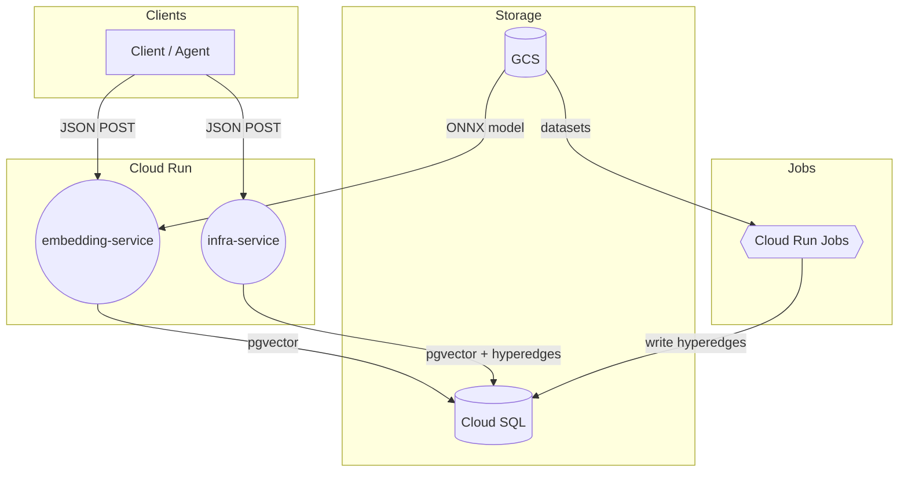
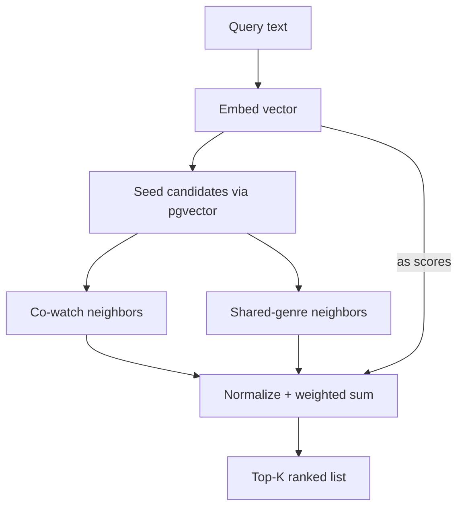
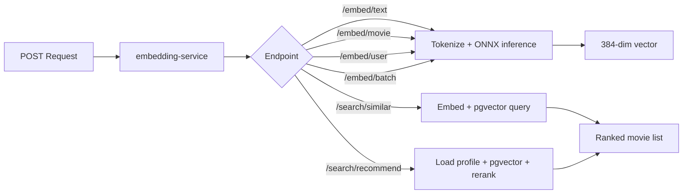
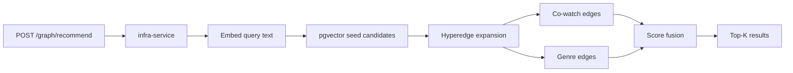
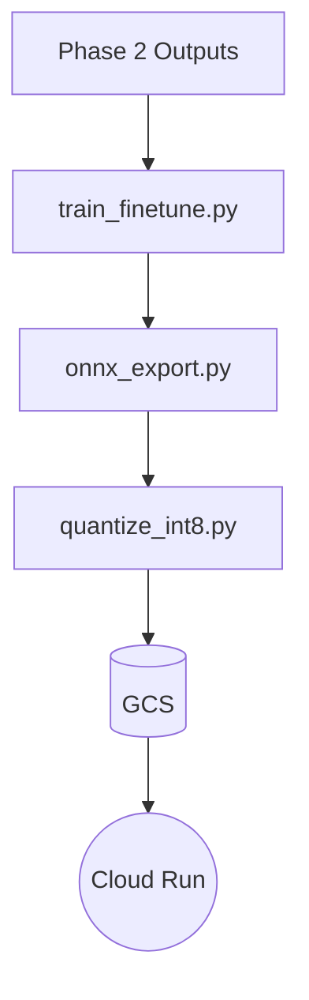

# CR-HyperVR

**Cloud Run Hypergraph-Vector Recommender** 

CPU-only FastAPI service using INT8 ONNX MiniLM, pgvector similarity, and hyperedge signals.

## What It Does

- Recommends films based on descriptions and user rating history
- Creates compact embeddings of movies and user taste profiles
- Searches for semantically similar content via vector similarity
- Enhances results using hypergraph signals (co-watch patterns, shared genres)
- Runs entirely on GCP Cloud Run with no GPU required

## Key Benefits

- **Low latency & cost** — INT8-quantized ONNX model runs efficiently on CPU
- **Cold-start friendly** — Hypergraph edges help recommend even with sparse user data
- **Scalable** — Cloud Run auto-scales based on traffic
- **Easy integration** — Simple JSON POST endpoints for any client or agent

---

## Quick Start

Live endpoints are public and ready to use:

| Service | URL |
|---------|-----|
| Embedding API | `https://embedding-service-5pgvctvdpq-nw.a.run.app` |
| Graph Service | `https://infra-service-5pgvctvdpq-nw.a.run.app` |

### Try It Now

**Embed free text:**
```bash
curl -s -X POST \
  https://embedding-service-5pgvctvdpq-nw.a.run.app/embed/text \
  -H 'Content-Type: application/json' \
  -d '{"text":"neo-noir heist with witty banter"}'
```

**Get graph-powered recommendations:**
```bash
curl -s -X POST \
  https://infra-service-5pgvctvdpq-nw.a.run.app/graph/recommend \
  -H 'Content-Type: application/json' \
  -d '{"query":"space opera adventure","top_k":5,"seed_top_k":15,"hops":2}'
```

### Full API Examples

<details>
<summary><strong>Search similar movies</strong></summary>

```bash
curl -s -X POST \
  https://embedding-service-5pgvctvdpq-nw.a.run.app/search/similar \
  -H 'Content-Type: application/json' \
  -d '{
        "text":"grounded space survival drama",
        "top_k": 10
      }'
```
</details>

<details>
<summary><strong>Recommend for a user ID</strong></summary>

```bash
curl -s -X POST \
  https://embedding-service-5pgvctvdpq-nw.a.run.app/search/recommend \
  -H 'Content-Type: application/json' \
  -d '{
        "user_id": 123,
        "top_k": 10,
        "exclude_movie_ids": [1,2,3]
      }'
```
</details>

<details>
<summary><strong>Embed a movie object</strong></summary>

```bash
curl -s -X POST \
  https://embedding-service-5pgvctvdpq-nw.a.run.app/embed/movie \
  -H 'Content-Type: application/json' \
  -d '{
        "title":"The Grand Budapest Hotel",
        "genres":["Comedy","Drama"],
        "description":"A whimsical concierge and lobby boy embark on capers across a pastel Europe."
      }'
```
</details>

<details>
<summary><strong>Embed a user taste profile</strong></summary>

```bash
curl -s -X POST \
  https://embedding-service-5pgvctvdpq-nw.a.run.app/embed/user \
  -H 'Content-Type: application/json' \
  -d '{
        "liked_genres":["Sci-Fi","Adventure"],
        "liked_movies":["Star Wars","Guardians of the Galaxy"],
        "disliked_genres":["Horror"]
      }'
```
</details>

<details>
<summary><strong>Batch embed texts</strong></summary>

```bash
curl -s -X POST \
  https://embedding-service-5pgvctvdpq-nw.a.run.app/embed/batch \
  -H 'Content-Type: application/json' \
  -d '{
        "texts": [
          "gritty detective thriller set in Boston",
          "lighthearted family fantasy with magical creatures"
        ]
      }'
```
</details>

<details>
<summary><strong>Graph recommendations with weight tuning</strong></summary>

```bash
curl -s -X POST \
  https://infra-service-5pgvctvdpq-nw.a.run.app/graph/recommend \
  -H 'Content-Type: application/json' \
  -d '{
        "query":"A feel-good romantic comedy set in New York City with witty banter and heartfelt moments.",
        "top_k": 5,
        "seed_top_k": 15,
        "hops": 2,
        "embed_weight": 1.0,
        "cowatch_weight": 0.5,
        "genre_weight": 0.25
      }'
```
</details>

---

## Architecture

Fully managed GCP infrastructure with automatic scaling and pay-per-use billing.



### Infrastructure Components

| Component | Purpose |
|-----------|---------|
| **Cloud Run Services** | Auto-scaling API endpoints for embedding and recommendations |
| **Cloud SQL (PostgreSQL 15)** | Stores movie embeddings and hyperedges with pgvector |
| **Cloud Storage** | Hosts datasets, trained models, and pipeline outputs |
| **Cloud Run Jobs** | Executes data pipelines and model training |
| **Secret Manager** | Secures database credentials |

### How It Works

1. **Query arrives** → Text is embedded using INT8 ONNX MiniLM
2. **Vector search** → pgvector finds semantically similar movies
3. **Graph expansion** → Hyperedges add co-watch and genre neighbors
4. **Score fusion** → Weighted combination produces final ranking



---

## API Reference

### Embedding Service Flow



### Infra Service Flow



### Embedding Endpoints

| Endpoint | Description | Response |
|----------|-------------|----------|
| `POST /embed/text` | Embed free text | `{ embedding, dimension, model }` |
| `POST /embed/batch` | Embed multiple texts | Array of embeddings |
| `POST /embed/movie` | Embed from title + genres + description | Embedding object |
| `POST /embed/user` | Embed user taste profile | Embedding object |

### Search Endpoints

| Endpoint | Description |
|----------|-------------|
| `POST /search/similar` | Vector search over movie embeddings |
| `POST /search/recommend` | Recommendations from user profile |
| `POST /graph/recommend` | Graph-enhanced recommendations |

### Health & Metrics

| Endpoint | Description |
|----------|-------------|
| `GET /healthz` | Health check |
| `GET /ready` | Readiness probe |
| `GET /metrics` | Service metrics |

**Export OpenAPI spec:**
```bash
make export-openapi
```

---

## Data Pipeline

### Data Sources

- **TMDB** — Movie descriptions from Kaggle dataset `tmdb-movies-dataset-2023-930k-movies`
- **MovieLens 25M** — User ratings for collaborative signals

### Embedding Model

- **MiniLM-L6-v2** — Base embedding model from sentence-transformers

### Pipeline Phases



| Phase | Script | Output |
|-------|--------|--------|
| **Join** | `scripts/join_datasets.py` | Merged TMDB + MovieLens Parquet |
| **Train** | `training/train_finetune.py` | Fine-tuned MiniLM model |
| **Export** | `training/onnx_export.py` | `model.onnx` |
| **Quantize** | `training/quantize_int8.py` | `model-int8.onnx` |
| **Validate** | `scripts/validate_hyperedges.py` | DB edge verification |

---

## GCP Deployment

### Prerequisites

Enable these GCP APIs:
- Cloud Run
- Cloud Build
- Artifact Registry
- Cloud SQL Admin
- Secret Manager
- VPC Access
- Cloud Storage

### Provision Infrastructure

```bash
PROJECT_ID=agentics-foundation25lon-1809 \
REGION=europe-west2 \
AR_REPO=embedding-service \
BUCKET_NAME=${PROJECT_ID}-${REGION}-embeddings \
SQL_INSTANCE=embeddings-sql-${REGION} \
DB_NAME=movies DB_USER=app_user \
make gcp-provision
```

### Configure Secrets

```bash
make gcp-secrets
```

### Deploy Services

**Embedding service:**
```bash
REGION=europe-west2 make gcp-build

PROJECT_ID=agentics-foundation25lon-1809 REGION=europe-west2 \
  SERVICE_NAME=embedding-service \
  MODEL_GCS_URI=gs://agentics-foundation25lon-1809-europe-west2-models-20251207/models/movie-minilm-v1/model-int8.onnx \
  make gcp-deploy
```

**Infra service (graph recommendations):**
```bash
PROJECT_ID=agentics-foundation25lon-1809 REGION=europe-west2 \
  SERVICE_NAME=infra-service make gcp-deploy-infra
```

### Deploy Pipeline Jobs

```bash
# Deploy jobs
PROJECT_ID=agentics-foundation25lon-1809 REGION=europe-west2 \
  AR_REPO=embedding-service make gcp-jobs-deploy

# Run Phase 2 (embeddings + hyperedges)
PROJECT_ID=agentics-foundation25lon-1809 REGION=europe-west2 make gcp-job-run-phase2

# Run Phase 3 (fine-tuning → ONNX → INT8)
PROJECT_ID=agentics-foundation25lon-1809 REGION=europe-west2 make gcp-job-run-phase3
```

---

## Configuration

### Environment Variables

| Variable | Description | Default |
|----------|-------------|---------|
| `DATABASE_URL` | PostgreSQL connection (via Secret Manager) | — |
| `MODEL_GCS_URI` | GCS path to ONNX model | — |
| `EMBEDDING_BACKEND` | Backend selection | `auto` |
| `USE_GRAPH_SCORER` | Enable graph scoring | `false` |
| `USE_RERANKER` | Enable reranking | `false` |
| `VECTOR_DIM` | Embedding dimension | `384` |
| `LOG_LEVEL` | Logging verbosity | `INFO` |
| `ALLOWED_ORIGINS` | CORS origins (comma-separated) | — |

### Embedding Backends

| Value | Description |
|-------|-------------|
| `auto` | Auto-detect best available |
| `onnx` | ONNX Runtime (recommended) |
| `st` | Sentence Transformers |
| `hash` | Hash-based fallback |

---

## Roadmap

- [ ] Curriculum sampling with temperature-controlled hard negatives
- [ ] Weak supervision from genre and co-watch edges during training
- [ ] Portable ONNX with shared tokenizer
- [ ] TinyBERT/MiniLM cross-encoder reranker
- [ ] Nightly retraining with drift detection
- [ ] Canary deployments with automated guardrails

---
